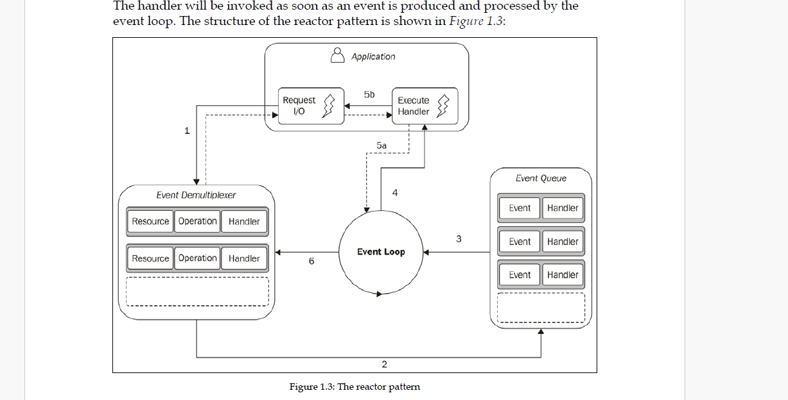

# NODEJS MANTIĞI

📌 Neden Node.js ortaya çıktı?

İşlemci (CPU) ve bellek (RAM) çok hızlı çalışırken, bazı işlemler oldukça yavaştır:

- Diskten dosya okumak
- Ağdan veri çekmek
- Veritabanı sorgusu yapmak
- Kullanıcıdan giriş beklemek

Bu işlemlere **I/O işlemleri** denir.

Geleneksel **blocking sistemlerde**, program bu işlemler bitene kadar bekler ve başka iş yapamaz.Bu noktada apache gıbı sunucular her istek için yanı her kullanıcı ıcın single thread olusturur onlem olarak.Eğer çok popüler bir web uygulaması geliştiriyorsan ve sunucuna aynı anda 10.000 kişi bağlanırsa, sistemin her bir kullanıcı için ayrı bir thread oluşturmaya çalışması sence sunucu donanımında (bellek tüketimi, işlemci yorgunluğu vb.) ne gibi yönetimsel krizlere veya darboğazlara yol açar?

---

📌 Apache gibi eski sistemler nasıl çalışıyordu?

Apache gibi klasik sunucular, her kullanıcı isteği için genellikle ayrı bir **thread** oluştururdu.

Örnek:

- 1 kullanıcı = 1 thread
- 100 kullanıcı = 100 thread
- 10.000 kullanıcı = 10.000 thread

Bu yöntem küçük projelerde iyidir ama büyük sistemlerde sorun çıkarır.

---

📌 10.000 kullanıcı bağlanırsa ne olur?

Her thread için işletim sistemi RAM’de özel alan ayırır.

Genelde:

- 1 thread ≈ 1 MB - 2 MB RAM

Yani:

- 10.000 thread ≈ 10 GB - 20 GB RAM

Sadece bekleyen kullanıcılar için bile büyük kaynak tüketimi oluşur.

### Sorunlar:

- RAM tükenir
- CPU sürekli thread yönetir
- Context switching artar
- Sunucu yavaşlar
- Çökme riski oluşur

---

📌 Node.js bunu nasıl çözdü?

Node.js, her kullanıcı için yeni thread açmaz.
Node.js, 10.000 bağlantı için 10.000 thread açmak yerine, her şeyi tek bir ana thread üzerinden yönetir..

Bunun yerine:

✅ T
✅ Event Loop kullanır  
✅ Non-blocking çalışır  
✅ Binlerce bağlantıyı aynı anda yönetebilir

Yani:

- 10.000 kullanıcı = 1 ana thread + arka plan sistemleri

---

📌 Thread değil, işlemler birbirini beklemez

Node.js içinde JavaScript kodu tek thread üzerinde çalışır.

Ama şu işlemler beklemeden devam eder:

- Dosya okuma
- HTTP isteği
- Database sorgusu
- Timer işlemleri

Yani birbirini beklemeyen şey **thread değil**, işlemlerdir.

---

📌 Process vs Thread

## 🏭 Process (Süreç)

Çalışan programdır.

Örneğin:

- node app.js
- chrome.exe

Kendi belleği ve kaynakları vardır.

## 🧵 Thread

Process içinde çalışan işçidir.

Örnek:

- JavaScript ana thread
- Worker thread

### Benzetme:

- Process = Fabrika
- Thread = İşçi

---

📌 Axios isteği backend'e gidince ne olur?

Tarayıcıdan şu istek gelsin:
ANALIZ
1. Kapıdaki Nöbetçi: İşletim Sistemi ve Demultiplexer 🛡️

Senin axios isteğin backend sunucusunun kapısına (örneğin 3000. port) vurduğunda, onu karşılayan ilk şey Node.js değil, İşletim Sistemi (OS) çekirdeğidir.
Event Demultiplexer: Bu yapı Node.js'e ait değildir; işletim sisteminin bir parçasıdır (Linux'ta epoll, macOS'ta kqueue, Windows'ta IOCP).
Libuv: Node.js içindeki bu kütüphane, OS'in bu farklı demultiplexer yapılarını "sarmalar" ve Node.js'in anlayacağı ortak bir dile dönüştürür.

İşleyiş: OS, porta gelen veriyi izler. Veri geldiğinde Demultiplexer bunu bir "olay" (event) olarak işaretler ve "Veri hazır!" diyerek haberi Node.js'e gönderir.

Node.js'teki Durum Nedir? 🤔

Node.js uygulamanı başlattığında işletim sistemi tek bir process başlatır. Senin yazdığın JavaScript kodları ise bu sürecin içindeki tek bir ana thread üzerinde sırayla çalışır.(app.js dosyamız)

Evet, dediğin gibi Event Loop (Olay Döngüsü) sürekli dönen bir çark gibidir ve gelen her isteği (veya olayı) sırayla bu döngüye alıp işler.

Handler fonksiyonlarının birbirini etkilememesinin ve "birbirini beklememesinin" arkasında iki temel sebep var:
1. Kapsam ve Bağlam (Scope & Context) 🧠

Her bir handler fonksiyonu çağrıldığında, JavaScript motoru (V8) o çağrı için özel bir bellek alanı (execution context) oluşturur. Yani A kullanıcısının isteği için çalışan fonksiyon ile B kullanıcısının isteği için çalışan fonksiyon, aynı kod şablonunu kullansalar da bellekte farklı "dünyalarda" yaşarlar. Değişkenleri birbirine karışmaz.

2. "İşi Devretme" Mantığı 📦

Node.js'in asıl sırrı burada. Eğer bir handler fonksiyonu içinde ağır bir I/O işlemi (veritabanından veri çekmek gibi) varsa, Node.js bu işi işletim sistemine veya arka plandaki yardımcı işçilere devreder.

    Handler: "Benim bu veriye ihtiyacım var, bitince haber ver!" der ve o anki görevini tamamlar.

    Event Loop: Hemen bir sonraki isteğe (handler'a) geçer.

Böylece tek bir iş parçacığı (Single Thread), binlerce farklı isteği "başlatılmış" durumda tutabilir.

Node.js'in tek başına bir dil değil, bir platform (runtime) olduğunu kanıtlayan 4 temel içerik sunuluyor:

    V8: Google'ın JS kodunu makine diline çeviren süper hızlı motoru. 🚀

    Libuv: I/O işlemlerini ve asenkronluğu yöneten C++ kütüphanesi.

    Bindings (Bağlar): JavaScript dünyası ile C++ dünyasını birbirine bağlayan "tercümanlar".

    Core Library: Bizim fs, http, path gibi kullandığımız yüksek seviyeli JavaScript kütüphaneleri.
    
    Tarayıcı vs. Node.js: Tarayıcıda bir "hapiste" (sandbox) gibiyizdir; güvenliğimiz için dosya sistemine veya işletim sistemine erişemeyiz. Node.js'te ise bu sınırlar kalkar; dosya sistemine (fs), ağ soketlerine (net) ve işletim sistemi süreçlerine (process) doğrudan erişimimiz olur. 🔓

    1. V8: Tercüman ve Uygulayıcı 🧠

Senin yazdığın modern JavaScript kodunu (örneğin bir fs.readFile çağrısını) ilk karşılayan V8'dir. V8, bu kodu makine diline çevirir. Ancak V8 bir "tarayıcı motoru" olduğu için, dosya okuma veya internete bağlanma gibi işletim sistemi işlerini tek başına yapamaz. Bu noktada yardım ister.
,,,,,,,,,,,,