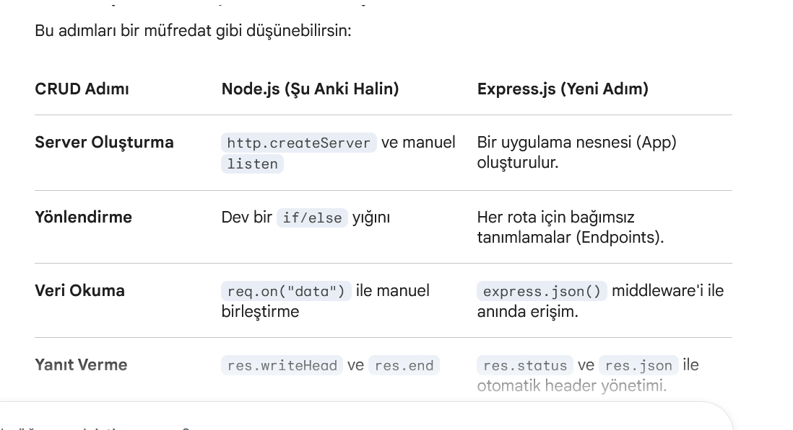
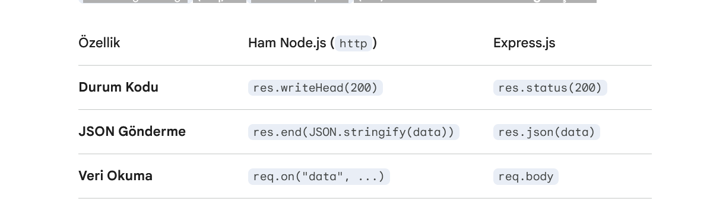
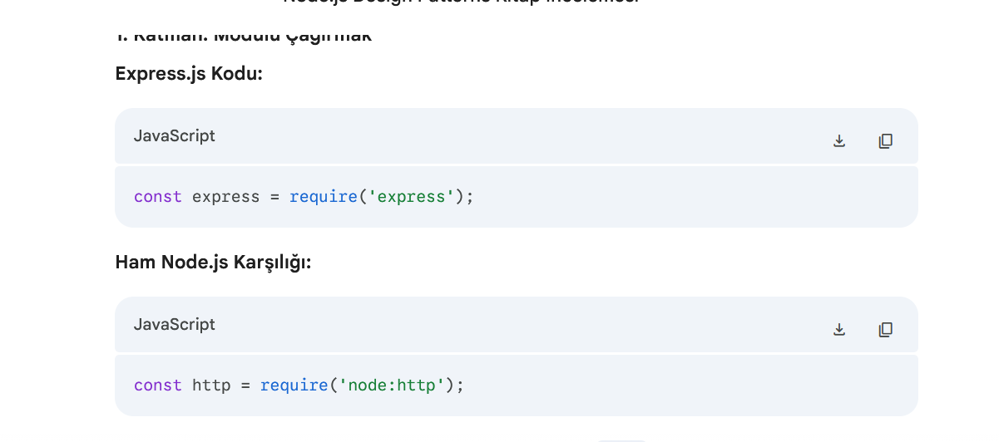
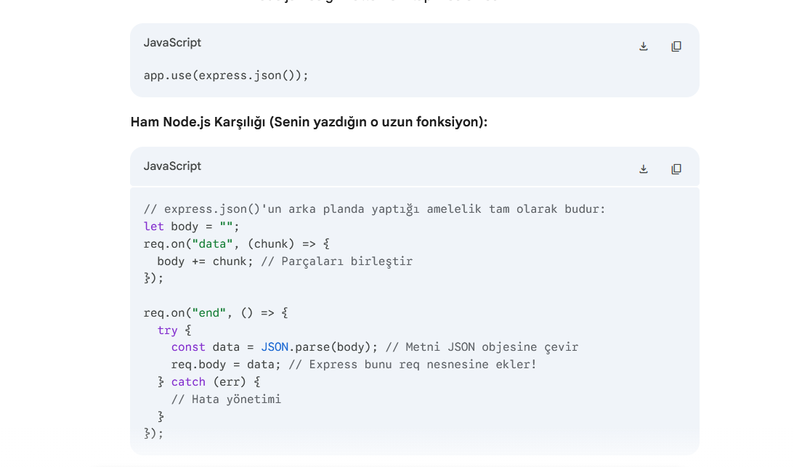

EXPRESS .JS

Express her seyi ara yazılım dedıgımz middleware mantıgında yapıyor.Nasıl oluyor bu durum :

Sen const app = express(); dediğinde, Express arka planda aslında Node.js'in http.createServer() fonksiyonunu çağırır.
Node.js'te: Sen o devasa callback fonksiyonunu ((req, res) => { ... }kendin yazıyordun.
Express'te: app nesnesi aslında bu callback fonksiyonunun ta kendisidir. Express, senin için o "olay dinleyiciyi" (Event Listener) oluşturur ve içine kendi yönetim mekanizmasını kurar.

2.  express.json(): Senin parseRequestBody Fonksiyonun! 🛠️

Kodunda yazdığın app.use(express.json()); satırı, senin o zahmetle yazdığın req.on("data") ve req.on("end") bloklarının tam olarak aynısını yapar.

    Süreç: İstek (Request) porttan içeri girer girmez, Express bu "json" katmanını (middleware) devreye sokar.

    İşlem: Gelen bitleri toplar, birleştirir, JSON.parse() yapar ve sonucu req.body adında yeni bir kutuya koyar.

    Sonuç: Sen bir sonraki satıra geçtiğinde veri çoktan "JavaScript objesi" haline gelmiştir. Yani Express işi sınıflara değil, bu asenkron "duraklara" (middleware) paylaştırır.

3. "Decorated" Nesneler: req ve res Sınıfları

Senin sorduğun "class" mevzusu burada devreye giriyor. Express, Node.js'in o ham IncomingMessage (req) ve ServerResponse (res) nesnelerini alır ve onları genişletir.

Express, bu nesnelerin üzerine yeni fonksiyonlar "giydirir". Kitapta buna "Decorator Pattern" denir. Yani nesneyi çöpe atmaz, ona "süper güçler" ekler. 4. Routing: if/else Yerine "Stack" (Yığın)

Senin manuel yazdığın if (req.url == "/items") blokları yerine, Express bir Router Stack tutar.

    Sen her app.get() veya app.post() yazdığında, Express içindeki bir listeye (array) şu kaydı geçer: "Eğer URL şuyse, şu fonksiyonu çalıştır."

    Bir istek geldiğinde, Express bu listenin en başından başlar ve URL eşleşene kadar aşağı doğru iner. Senin manuel yaptığın "Demultiplexing" işlemini o otomatik bir döngüyle yapar.

    A. Parametrelerin Sihri (req.params)

Kodunda :id veya :kategori/:id gibi yapılar kullandın.

    Arka Planda Ne Oluyor? Express, senin yerine bir Regex (Düzenli İfade) motoru çalıştırır. Sen :id yazdığında, Express "Buraya her türlü metin gelebilir, onu yakala ve req.params objesinin içine id anahtarıyla koy" der.Kritik Nokta: Notunda belirttiğin gibi, URL üzerinden gelen her şey String'dir. Sen Number(req.params.id) yaparak V8 motoruna "Bunu sayı olarak işle" talimatı veriyorsun. Eğer bunu yapmazsan, === (sıkı eşitlik) kontrolünde 1 === "1" sonucu false döner ve ürünü bulamazsın.

    Arka Planda Ne Oluyor? Express, senin yerine bir Regex (Düzenli İfade) motoru çalıştırır. Sen :id yazdığında, Express "Buraya her türlü metin gelebilir, onu yakala ve req.params objesinin içine id anahtarıyla koy" der.

    Kritik Nokta: Notunda belirttiğin gibi, URL üzerinden gelen her şey String'dir. Sen Number(req.params.id) yaparak V8 motoruna "Bunu sayı olarak işle" talimatı veriyorsun. Eğer bunu yapmazsan, === (sıkı eşitlik) kontrolünde 1 === "1" sonucu false döner ve ürünü bulamazsın.

B. Filtreleme ve Esneklik (req.query)

/ara rotasında kullandığın req.query yapısı, kitabın Bölüm 1'de bahsettiği "Optional Inputs" (Opsiyonel Girdiler) mantığına dayanır.

    Params vs Query: params genellikle bir kaynağın kimliğini (ID) belirtmek için kullanılır. query ise o kaynağı nasıl görmek istediğimizi (filtreleme, sıralama) söyler.

    Spread Operator: let sonuc = [...urunler]; yaparak orijinal dizinin bir kopyasını oluşturman çok profesyonelce. Bu, orijinal veriyi (state) yanlışlıkla bozmanı engeller.

C. Gövde Analizi (req.body)

POST ve PUT isteklerinde req.body kullandın.

    Tercüme: En başta yazdığın app.use(express.json()) middleware'i olmasaydı, req.body şu an undefined dönerdi. Express, gelen o "parça parça" (chunk) verileri arka planda senin için birleştirip bu objeyi oluşturdu.

1. Katman: Modülü Çağırmak
   Express.js Kodu:Açıklama: Ham Node.js'te çekirdek kütüphane olan http modülünü çağırıyorduk. Express'te ise, bu http modülünün üzerine inşa edilmiş ve işleri kolaylaştıran express paketini çağırıyoruz.

2. Katman: Sunucuyu ve "Handler"ı (Dinleyiciyi) Oluşturmak
   Açıklama: Sen express() fonksiyonunu çalıştırıp app değişkenine atadığında, Express aslında arka planda http.createServer'ı kurar.

O devasa (req, res) => { ... } callback fonksiyonunu (handler) artık sen elle yazmazsın; app nesnesi bu yönlendirme (routing) işini kendi içindeki akıllı mekanizmalarla yönetmek üzere senin yerine devralır.

3. Katman: Veri Akışını (Stream) Yakalamak ve Çevirmek

Express.js Kodu:

: İşte Express'in en büyük sihri buradadır! express.json() bir middleware'dir (ara yazılım).

Ham Node.js'te verinin porttan "chunk" (parça parça) aktığını, bunu Buffer'da birleştirip end olayını beklediğini ve en son JSON.parse ile objeye çevirdiğini hatırlıyorsun değil mi? İşte bu tek satır, o zorlu "Stream" (Akış) yönetiminin tamamını kendi başına yapar ve sonucu req.body adında hazır bir paket olarak sana sunar.