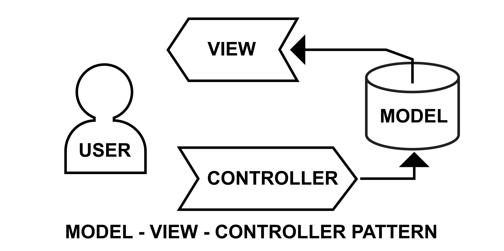

###  MODEL- VIEW- CONTROLLER PATTERN
1.Müşteri (Frontend/Postman): "Bana sistemdeki tüm görevleri (todos) listele" diyerek bir sipariş verir.
2.Garson (Route): Bu siparişi alır (örneğin GET /todos isteği) ve doğrudan doğru Aşçıya (Controller'a) yönlendirir.
3.Aşçıbaşı (Controller): Siparişi teslim alır. İşlemi yapabilmek için hemen Kiler Sorumlusuna (Model'e) döner ve talimat verir: "Bana depodaki tüm görevleri getir."
4.Kiler Sorumlusu (Model): Veritabanına (PostgreSQL) iner, SQL sorgularını çalıştırır, verileri alır ve Aşçıya teslim ede
5.Sunum (Controller): Aşçı, gelen ham verileri güzel bir tabağa yerleştirir (JSON formatına çevirir) ve müşteriye servis etmesi için res.json() ile yanıtı gönderir.
6.Yani todoController.js dosyasının içindeki fonksiyonlar, sadece "Ne yapmalıyım? Kimden veri almalıyım? Müşteriye ne cevap vermeliyim?" kararlarını veren merkezdir.
7.Şimdi mutfağımızda malzemeleri getiren bir Kiler Sorumlusu (Model) ve yemeği hazırlamaya hazır bir Aşçı (Controller) var. Geriye müşterinin siparişini kapıdan alıp doğru aşçıya teslim edecek olan Garsonu (Route) görevlendirmek kald